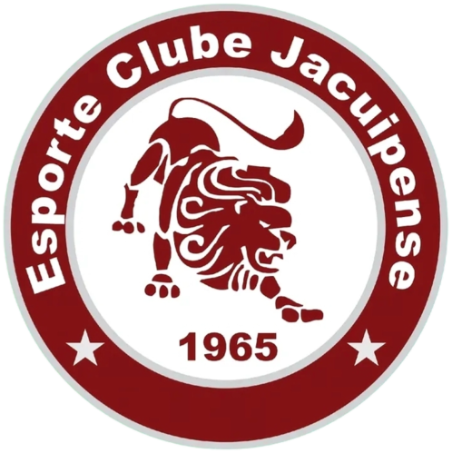

<div align="center">



# Esporte Clube Jacuipense — Fan Website

An informational website dedicated to **Esporte Clube Jacuipense** from Riachão do Jacuípe, Bahia. It presents the club's history, news, match schedule, and official channels, built with a semantic structure and clean, simple navigation.


[View Live Site](https://jacuipense.vercel.app) · [Report an Issue](https://github.com/TadeuHPSA/jacuipense-site/issues)

</div>

---

## Table of Contents

- [Overview](#overview)
- [Features](#features)
- [Technologies](#technologies)
- [Project Structure](#project-structure)
- [How to Run](#how-to-run)
- [Deployment](#deployment)
- [Roadmap](#roadmap)
- [Disclaimer](#disclaimer)
- [Author](#author)

## Overview

This project was developed as a practical exercise in HTML5 and CSS3, applying best practices in semantic markup, content organization, tables, forms, and external links. The focus is to clearly present the club's journey, from its founding in 1965 to its historic campaign in the 2026 Copa do Brasil.

## Features

- Header featuring the club crest and a navigation menu
- Historic timeline divided into thematic sections
- News section with links to press outlets
- Match schedule in table format
- Contact form (name, email, and subject)
- Footer with social media links and the official store
- Additional institutional page (`sobre.html`)

## Technologies

| Technology | Usage                         |
| ---------- | ----------------------------- |
| HTML5      | Structure and semantic markup |
| CSS3       | Styling and layout            |

## Project Structure

```text
jacuipense-site/
├── site.html          # Homepage
├── sobre.html         # Institutional page
├── style.css          # Stylesheet
└── ECJacuipense.png   # Club crest
```

## How to Run

There are no dependencies to install.

```bash
# Clone the repository
git clone https://github.com/TadeuHPSA/jacuipense-site.git

# Navigate to the directory
cd jacuipense-site
```

Then open the `site.html` file in any modern web browser.

## Deployment

The site is deployed on **Vercel** and available at [jacuipense.vercel.app](https://jacuipense.vercel.app).

It can also be hosted for free with **GitHub Pages**:

1. Go to **Settings → Pages** in your repository.
2. Under **Branch**, select `main` and the `/ (root)` folder.
3. Save and wait for the deployment to finish. The live URL will be displayed on the same screen.

## Roadmap

- [ ] Responsive layout for mobile devices
- [ ] Regular updates to the match schedule
- [ ] Integration of the contact form with an email-sending service
- [ ] Photo gallery and club achievements
- [ ] Squad and results history page
- [ ] Accessibility and SEO improvements

## Disclaimer

This is an independent, non-profit project created for educational purposes. The crest, name, and other trademarks belong to Esporte Clube Jacuipense and their respective rights holders.

## Author

**Tadeu Henrique**
Riachão do Jacuípe, Bahia

[GitHub](https://github.com/TadeuHPSA) · [LinkedIn](https://www.linkedin.com/in/thpsa-dev)
